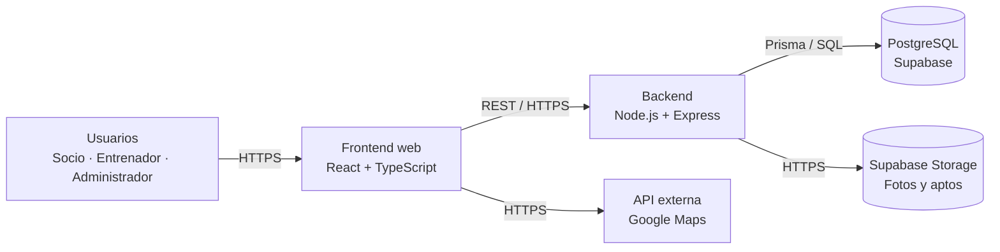

# Diagrama de Arquitectura — M-Team

```mermaid
flowchart LR
    U["Usuarios<br/>Socio · Entrenador · Administrador"]
    FE["Frontend web<br/>React + TypeScript"]
    BE["Backend<br/>Node.js + Express"]
    MAPS["API externa<br/>Google Maps"]
    DB[("PostgreSQL<br/>Supabase")]
    STORAGE[("Supabase Storage<br/>Fotos y aptos")]

    U -->|"HTTPS"| FE
    FE -->|"REST / HTTPS"| BE
    FE -->|"HTTPS"| MAPS
    BE -->|"Prisma / SQL"| DB
    BE -->|"HTTPS"| STORAGE
```
