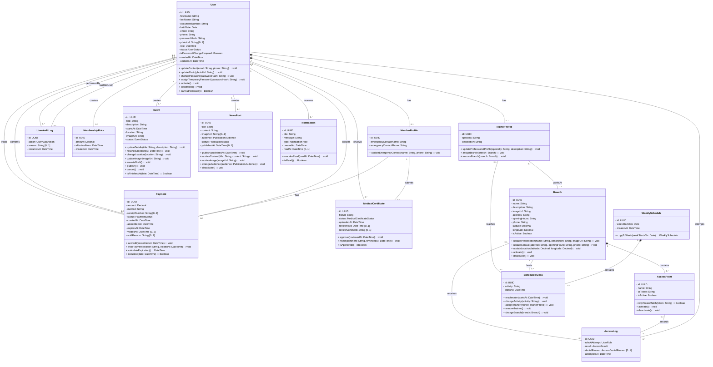

# Diagrama de clases

```mermaid
classDiagram
direction TB

class User {
  - id: UUID
  - firstName: String
  - lastName: String
  - documentNumber: String
  - birthDate: Date
  - email: String
  - phone: String
  - passwordHash: String
  - photoUrl: String [0..1]
  - role: UserRole
  - status: UserStatus
  - isPasswordChangeRequired: Boolean
  - createdAt: DateTime
  - updatedAt: DateTime
  + updateContact(email: String, phone: String): void
  + updatePhoto(photoUrl: String): void
  + changePassword(passwordHash: String): void
  + assignTemporaryPassword(passwordHash: String): void
  + activate(): void
  + deactivate(): void
  + canAuthenticate(): Boolean
}

class MemberProfile {
  - id: UUID
  - emergencyContactName: String
  - emergencyContactPhone: String
  + updateEmergencyContact(name: String, phone: String): void
}

class TrainerProfile {
  - id: UUID
  - specialty: String
  - description: String
  + updateProfessionalProfile(specialty: String, description: String): void
  + assignBranch(branch: Branch): void
  + removeBranch(branch: Branch): void
}

class UserAuditLog {
  - id: UUID
  - action: UserAuditAction
  - reason: String [0..1]
  - occurredAt: DateTime
}

class MembershipPrice {
  - id: UUID
  - amount: Decimal
  - effectiveFrom: DateTime
  - createdAt: DateTime
}

class Payment {
  - id: UUID
  - amount: Decimal
  - method: String
  - receiptNumber: String [0..1]
  - status: PaymentStatus
  - createdAt: DateTime
  - accreditedAt: DateTime
  - expiresAt: DateTime
  - voidedAt: DateTime [0..1]
  - voidReason: String [0..1]
  + accredit(accreditedAt: DateTime): void
  + voidPayment(reason: String, voidedAt: DateTime): void
  + calculateExpiration(): DateTime
  + isValidAt(date: DateTime): Boolean
}

class MedicalCertificate {
  - id: UUID
  - fileUrl: String
  - status: MedicalCertificateStatus
  - uploadedAt: DateTime
  - reviewedAt: DateTime [0..1]
  - reviewComment: String [0..1]
  + approve(reviewedAt: DateTime): void
  + reject(comment: String, reviewedAt: DateTime): void
  + isApproved(): Boolean
}

class Branch {
  - id: UUID
  - name: String
  - description: String
  - imageUrl: String
  - address: String
  - openingHours: String
  - phone: String
  - latitude: Decimal
  - longitude: Decimal
  - isActive: Boolean
  + updatePresentation(name: String, description: String, imageUrl: String): void
  + updateContact(address: String, openingHours: String, phone: String): void
  + updateLocation(latitude: Decimal, longitude: Decimal): void
  + activate(): void
  + deactivate(): void
}

class AccessPoint {
  - id: UUID
  - name: String
  - qrToken: String
  - isActive: Boolean
  + isQrTokenMatch(token: String): Boolean
  + activate(): void
  + deactivate(): void
}

class AccessLog {
  - id: UUID
  - roleAtAttempt: UserRole
  - result: AccessResult
  - denialReason: AccessDenialReason [0..1]
  - attemptedAt: DateTime
}

class WeeklySchedule {
  - id: UUID
  - weekStartsOn: Date
  - createdAt: DateTime
  + copyToWeek(weekStartsOn: Date): WeeklySchedule
}

class ScheduledClass {
  - id: UUID
  - activity: String
  - startsAt: DateTime
  + reschedule(startsAt: DateTime): void
  + changeActivity(activity: String): void
  + assignTrainer(trainer: TrainerProfile): void
  + removeTrainer(): void
  + changeBranch(branch: Branch): void
}

class Event {
  - id: UUID
  - title: String
  - description: String
  - startsAt: DateTime
  - location: String
  - imageUrl: String
  - status: EventStatus
  + updateDetails(title: String, description: String): void
  + reschedule(startsAt: DateTime): void
  + changeLocation(location: String): void
  + updateImage(imageUrl: String): void
  + saveAsDraft(): void
  + publish(): void
  + cancel(): void
  + isFinishedAt(date: DateTime): Boolean
}

class NewsPost {
  - id: UUID
  - title: String
  - content: String
  - imageUrl: String [0..1]
  - audience: PublicationAudience
  - status: PublicationStatus
  - publishedAt: DateTime [0..1]
  + publish(publishedAt: DateTime): void
  + updateContent(title: String, content: String): void
  + updateImage(imageUrl: String): void
  + changeAudience(audience: PublicationAudience): void
  + deactivate(): void
}

class Notification {
  - id: UUID
  - title: String
  - message: String
  - type: NotificationType
  - createdAt: DateTime
  - readAt: DateTime [0..1]
  + markAsRead(readAt: DateTime): void
  + isRead(): Boolean
}

User "1" *-- "0..1" MemberProfile : has
User "1" *-- "0..1" TrainerProfile : has
User "1" -- "0..*" UserAuditLog : auditedUser
User "0..1" -- "0..*" UserAuditLog : performedBy
MemberProfile "1" -- "0..*" Payment : has
MemberProfile "1" -- "0..*" MedicalCertificate : submits
User "1" -- "0..*" MembershipPrice : creates
User "1" -- "0..*" Payment : creates
User "0..1" -- "0..*" Payment : confirms
User "0..1" -- "0..*" Payment : voids
User "0..1" -- "0..*" MedicalCertificate : reviews
Branch "1" *-- "0..*" AccessPoint : contains
User "1" -- "0..*" AccessLog : attempts
AccessPoint "0..1" -- "0..*" AccessLog : records
TrainerProfile "0..*" -- "0..*" Branch : worksAt
WeeklySchedule "1" *-- "0..*" ScheduledClass : contains
Branch "1" -- "0..*" ScheduledClass : hosts
TrainerProfile "0..1" -- "0..*" ScheduledClass : teaches
User "1" -- "0..*" Event : creates
User "1" -- "0..*" NewsPost : creates
User "1" -- "0..*" Notification : receives
Branch "0..1" -- "0..*" AccessLog : receives
```
