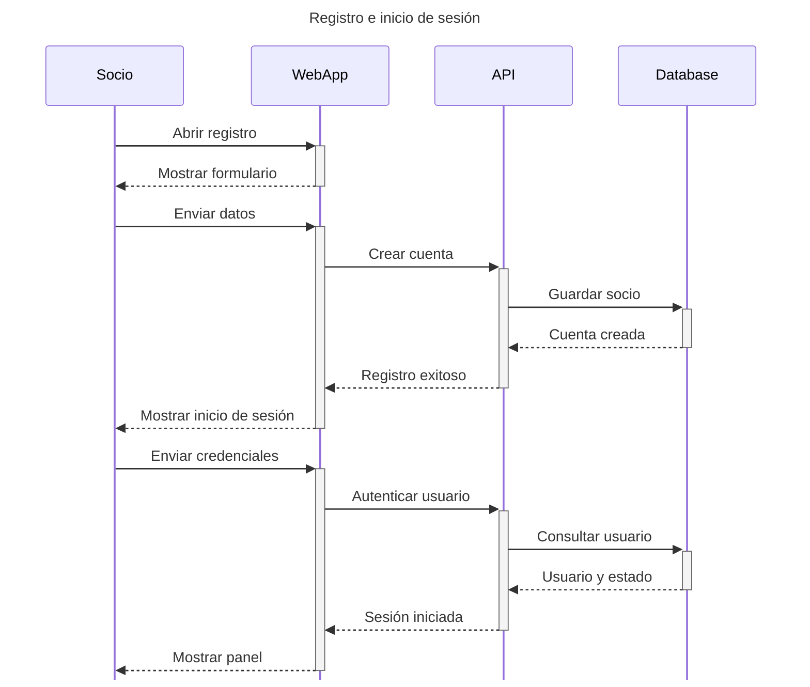
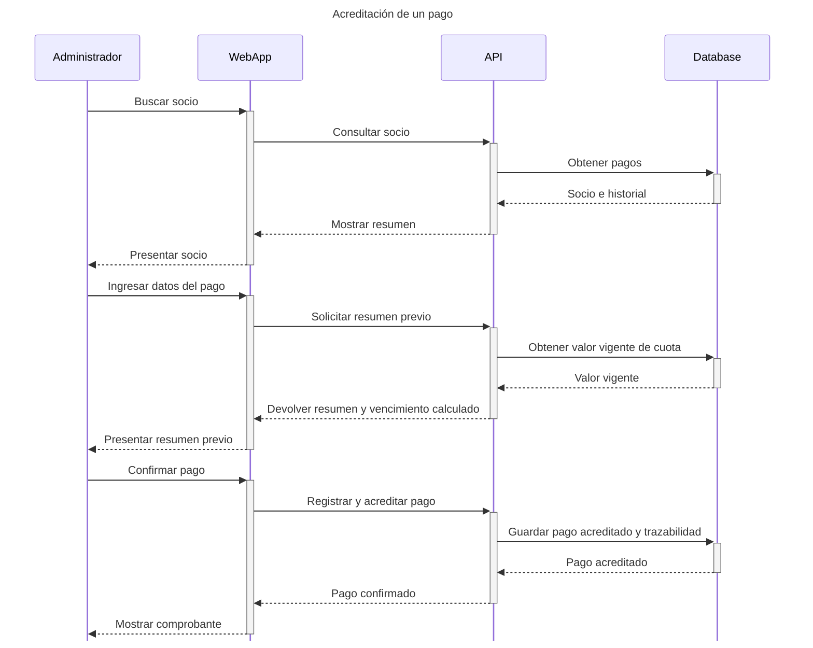
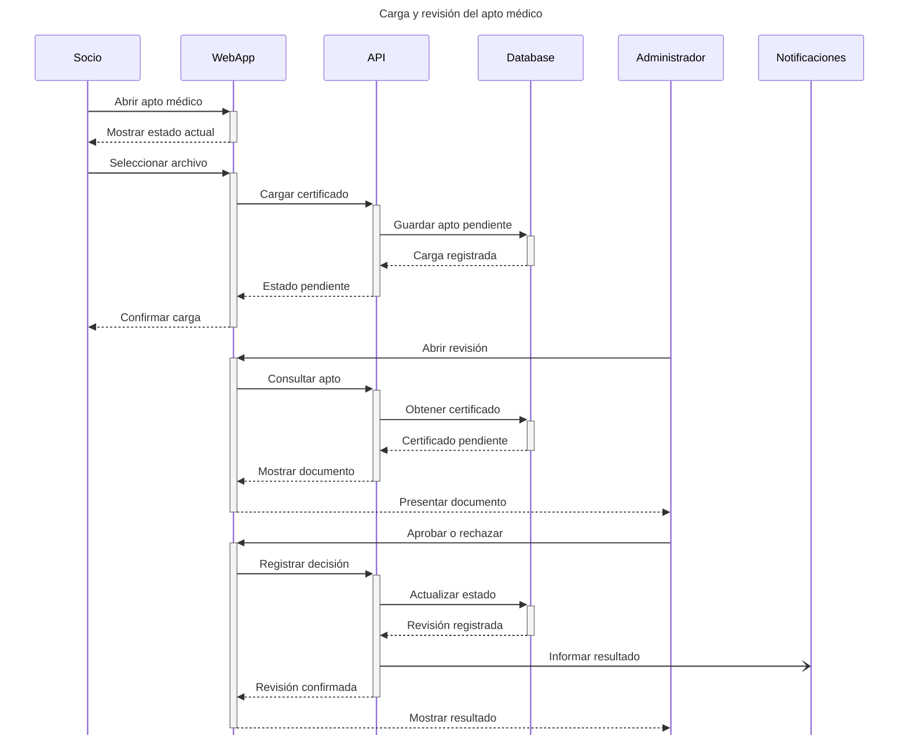
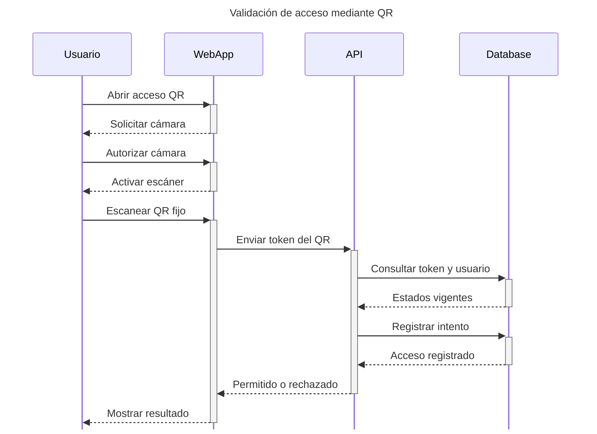
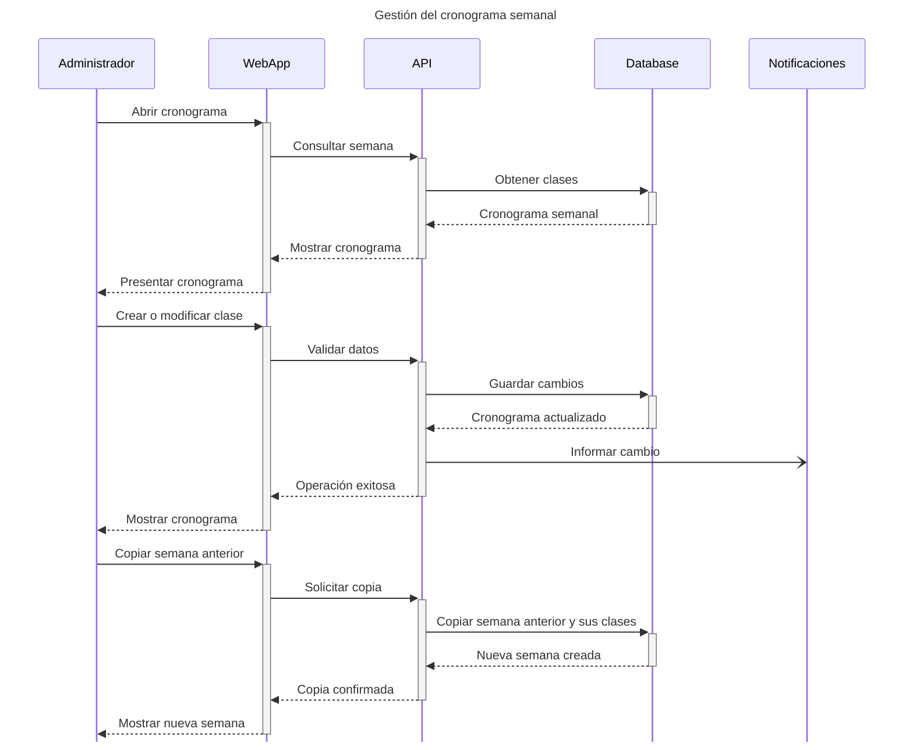
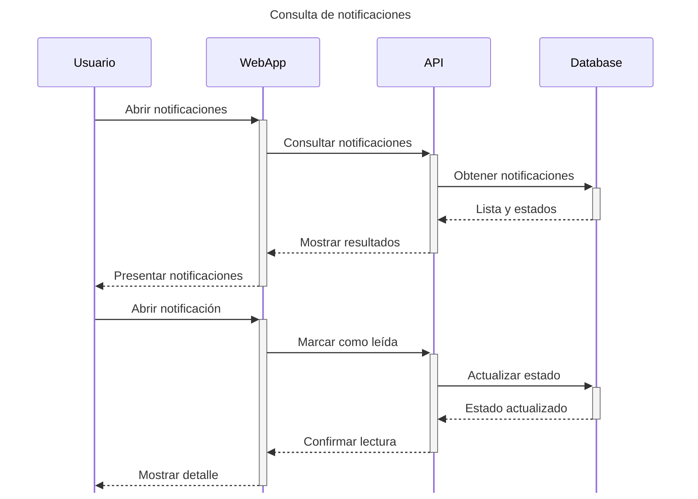

# Diagramas de secuencia

Estos diagramas documentan las interacciones principales del prototipo de M-Team. Los diagramas representan responsabilidades conceptuales. `WebApp` corresponde a la interfaz web, `API` al backend de M-Team y `Database` a la persistencia del sistema.

## Registro e inicio de sesión

La recuperación automática por correo no forma parte del alcance. Cuando sea necesario restablecer una contraseña, el socio deberá solicitarlo a un administrador.

## Acreditación de un pago

La acreditación es una operación administrativa. El resumen previo no se persiste: `Payment` nace con estado `ACCREDITED` cuando el administrador confirma la operación. En ese momento se registran la creación, la confirmación, sus responsables y la vigencia de 30 días. El sistema no incorpora pagos en línea ni planes de membresía.

## Carga y revisión del apto médico

El resultado de la revisión puede ser aprobado o rechazado con una observación. Cada nueva carga queda pendiente y el historial se conserva.

## Validación de acceso mediante QR

El QR pertenece al punto de acceso físico, no al usuario. Un rechazo puede deberse a un QR inválido, una cuenta inactiva, una cuota vencida, un apto no válido o una sede o punto de acceso desactivados.

## Gestión del cronograma semanal

El cronograma es informativo. No incluye reservas, cupos, listas de espera ni asistencia.

## Consulta de notificaciones

Las notificaciones son internas y conservan su historial. El alcance no contempla chat ni mensajería entre usuarios.

## Límites del alcance

Estos flujos no incorporan planes de membresía, pagos en línea, reservas, cupos, listas de espera, asistencia, rutinas, alumnos asignados, evaluaciones, beneficios, referidos, QR personal, chat ni una aplicación móvil nativa.
