# Modelo relacional de M-Team

Este modelo deriva del [diagrama de clases](./diagrama-de-clases.md) y de la [matriz de trazabilidad](./matriz-de-trazabilidad.md). Utiliza nombres de tablas y columnas en `snake_case`, tablas en singular y claves foráneas con el sufijo `_id`.

## Diagrama entidad-relación

```mermaid
erDiagram
    user {
        uuid id PK
        varchar first_name
        varchar last_name
        varchar document_number UK
        date birth_date
        varchar email UK
        varchar phone
        varchar password_hash
        varchar photo_url "nullable"
        UserRole role
        UserStatus status
        boolean is_password_change_required
        timestamptz created_at
        timestamptz updated_at
    }

    member_profile {
        uuid id PK
        uuid user_id FK,UK
        varchar emergency_contact_name
        varchar emergency_contact_phone
    }

    trainer_profile {
        uuid id PK
        uuid user_id FK,UK
        varchar specialty
        text description
    }

    membership_price {
        uuid id PK
        numeric amount
        timestamptz effective_from
        uuid created_by_id FK
        timestamptz created_at
    }

    payment {
        uuid id PK
        uuid member_id FK
        numeric amount
        varchar method
        varchar receipt_number "nullable"
        PaymentStatus status
        uuid created_by_id FK
        timestamptz created_at
        uuid confirmed_by_id FK
        timestamptz accredited_at
        timestamptz expires_at
        uuid voided_by_id FK "nullable"
        timestamptz voided_at "nullable"
        text void_reason "nullable"
    }

    medical_certificate {
        uuid id PK
        uuid member_id FK
        varchar file_url
        MedicalCertificateStatus status
        timestamptz uploaded_at
        uuid reviewed_by_id FK "nullable"
        timestamptz reviewed_at "nullable"
        text review_comment "nullable"
    }

    branch {
        uuid id PK
        varchar name UK
        text description
        varchar image_url
        varchar address UK
        varchar opening_hours
        varchar phone
        numeric latitude "nullable"
        numeric longitude "nullable"
        boolean is_active
    }

    access_point {
        uuid id PK
        uuid branch_id FK
        varchar name
        varchar qr_token UK
        boolean is_active
    }

    access_log {
        uuid id PK
        uuid user_id FK
        UserRole role_at_attempt
        uuid branch_id FK "nullable"
        uuid access_point_id FK "nullable"
        AccessResult result
        AccessDenialReason denial_reason "nullable"
        timestamptz attempted_at
    }

    weekly_schedule {
        uuid id PK
        date week_starts_on UK
        uuid copied_from_id FK "nullable"
        timestamptz created_at
    }

    scheduled_class {
        uuid id PK
        uuid schedule_id FK
        uuid branch_id FK
        uuid trainer_id FK "nullable"
        varchar activity
        timestamptz starts_at
    }

    trainer_branch {
        uuid id PK
        uuid trainer_id FK
        uuid branch_id FK
    }

    user_audit_log {
        uuid id PK
        uuid user_id FK
        uuid performed_by_id FK
        UserAuditAction action
        text reason "nullable"
        timestamptz occurred_at
    }

    event {
        uuid id PK
        varchar title
        text description
        timestamptz starts_at
        varchar location
        varchar image_url
        EventStatus status
        uuid created_by_id FK
    }

    news_post {
        uuid id PK
        varchar title
        text content
        varchar image_url "nullable"
        PublicationAudience audience
        PublicationStatus status
        timestamptz published_at "nullable"
        uuid created_by_id FK
    }

    notification {
        uuid id PK
        uuid user_id FK
        varchar title
        text message
        NotificationType type
        timestamptz created_at
        timestamptz read_at "nullable"
    }

    user ||--o| member_profile : has
    user ||--o| trainer_profile : has
    member_profile ||--o{ payment : owns
    member_profile ||--o{ medical_certificate : uploads
    user ||--o{ membership_price : creates
    user ||--o{ payment : creates
    user ||--o{ payment : confirms
    user o|--o{ payment : voids
    user o|--o{ medical_certificate : reviews
    branch ||--o{ access_point : contains
    user ||--o{ access_log : attempts
    branch o|--o{ access_log : receives
    access_point o|--o{ access_log : records
    weekly_schedule o|--o{ weekly_schedule : copied_from
    weekly_schedule ||--o{ scheduled_class : contains
    branch ||--o{ scheduled_class : hosts
    trainer_profile o|--o{ scheduled_class : teaches
    trainer_profile ||--o{ trainer_branch : works_at
    branch ||--o{ trainer_branch : has_trainers
    user ||--o{ user_audit_log : is_audited
    user ||--o{ user_audit_log : performs
    user ||--o{ event : creates
    user ||--o{ news_post : creates
    user ||--o{ notification : receives
```

## Enumeraciones

| Enumeración | Valores |
|---|---|
| `UserRole` | `MEMBER`, `TRAINER`, `ADMIN` |
| `UserStatus` | `ACTIVE`, `INACTIVE` |
| `PaymentStatus` | `ACCREDITED`, `VOIDED` |
| `MedicalCertificateStatus` | `PENDING`, `APPROVED`, `REJECTED` |
| `AccessResult` | `ALLOWED`, `DENIED` |
| `AccessDenialReason` | `INVALID_QR`, `INACTIVE_USER`, `INACTIVE_BRANCH`, `INACTIVE_ACCESS_POINT`, `EXPIRED_MEMBERSHIP`, `MEDICAL_CERTIFICATE_REQUIRED` |
| `UserAuditAction` | `CREATED`, `UPDATED`, `ACTIVATED`, `DEACTIVATED`, `PASSWORD_RESET` |
| `EventStatus` | `DRAFT`, `PUBLISHED`, `CANCELLED` |
| `PublicationAudience` | `ALL`, `MEMBERS`, `TRAINERS` |
| `PublicationStatus` | `DRAFT`, `PUBLISHED`, `INACTIVE` |
| `NotificationType` | `MEMBERSHIP_PRICE_CHANGED`, `MEMBERSHIP_EXPIRING`, `MEMBERSHIP_EXPIRED`, `MEDICAL_CERTIFICATE_REVIEWED`, `CLASS_CHANGED`, `EVENT_CANCELLED`, `GENERAL` |

Los nombres de las enumeraciones utilizan PascalCase y sus valores, UPPER_SNAKE_CASE. El medio de pago permanece como `varchar` hasta que M-Team confirme los valores aceptados; no se agrega una enumeración con opciones no definidas por el alcance.

## Restricciones principales

- `user.email` y `user.document_number` son únicos; el correo se compara normalizado en minúsculas.
- Cada usuario puede tener como máximo un perfil de socio o de entrenador, de forma coherente con su rol.
- `membership_price.amount` y `payment.amount` deben ser mayores que cero.
- `payment` nace cuando el administrador confirma la acreditación. Su estado inicial es `ACCREDITED`; no se persiste un estado `PENDING` que el alcance no define.
- `payment.expires_at` equivale a `accredited_at + 30 días`; una acreditación nueva no acumula días de la vigencia anterior.
- Todo pago registra por separado quién lo creó y quién lo confirmó. Si se anula, requiere `voided_by_id`, `voided_at` y `void_reason`.
- Un apto `PENDING` no tiene revisor, fecha de revisión ni comentario obligatorios.
- Un apto `APPROVED` requiere `reviewed_by_id` y `reviewed_at`, pero no tiene fecha de vencimiento.
- Un apto `REJECTED` requiere `reviewed_by_id`, `reviewed_at` y `review_comment`.
- `branch.name`, `branch.address` y `access_point.qr_token` son únicos.
- `access_log.denial_reason` es obligatorio cuando `result = DENIED` y nulo cuando `result = ALLOWED`.
- `access_log.branch_id` y `access_log.access_point_id` pueden ser nulos solamente cuando el QR es inexistente o fue alterado y el motivo es `INVALID_QR`.
- `weekly_schedule.copied_from_id` es opcional; identifica la semana de origen cuando el cronograma fue copiado.
- `weekly_schedule.week_starts_on` debe representar el comienzo acordado de una semana y ser único.
- `scheduled_class.trainer_id` es opcional; `branch_id` siempre es obligatorio.
- `trainer_branch` utiliza `id` como clave primaria y una restricción única compuesta sobre `(trainer_id, branch_id)` para evitar asignaciones duplicadas.
- Los estados de cuota `CURRENT`, `EXPIRING_SOON` y `EXPIRED` se calculan y no se persisten como columna.
- Los registros históricos no se eliminan al desactivar usuarios, entrenadores, sedes o puntos de acceso.

## Índices recomendados

| Tabla | Índice |
|---|---|
| `user` | `(role, status)`, `last_name`, `first_name` |
| `membership_price` | `effective_from DESC` |
| `payment` | `(member_id, accredited_at DESC)`, `(status, accredited_at)`, `receipt_number` |
| `medical_certificate` | `(member_id, uploaded_at DESC)`, `(status, uploaded_at)` |
| `access_log` | `(user_id, attempted_at DESC)`, `(branch_id, attempted_at DESC)`, `(result, attempted_at)` |
| `scheduled_class` | `(schedule_id, starts_at)`, `(trainer_id, starts_at)`, `(branch_id, starts_at)` |
| `trainer_branch` | `UNIQUE (trainer_id, branch_id)` |
| `event` | `(status, starts_at)` |
| `news_post` | `(status, audience, published_at DESC)` |
| `notification` | `(user_id, created_at DESC)`, `(user_id, read_at)` |

## Decisiones para la traducción a Prisma

- Los modelos Prisma utilizarán singular y PascalCase; los campos, camelCase.
- Las tablas PostgreSQL se mapearán en singular y snake_case, por ejemplo `MedicalCertificate` mediante `@@map("medical_certificate")`.
- La tabla `user` respeta la convención acordada, pero coincide con una palabra especial de SQL/PostgreSQL; Prisma deberá generar identificadores correctamente entrecomillados al crear las migraciones.
- Las claves primarias se generarán con UUID.
- Todos los instantes se almacenarán como `timestamptz`; las fechas sin hora utilizarán `date`.
- Las relaciones con datos históricos usarán `ON DELETE RESTRICT` o `NO ACTION`.
- Las clases son informativas: no se modelan reservas, cupos, listas de espera ni asistencia.
- No se modelan planes de membresía, pagos en línea ni QR personales.
